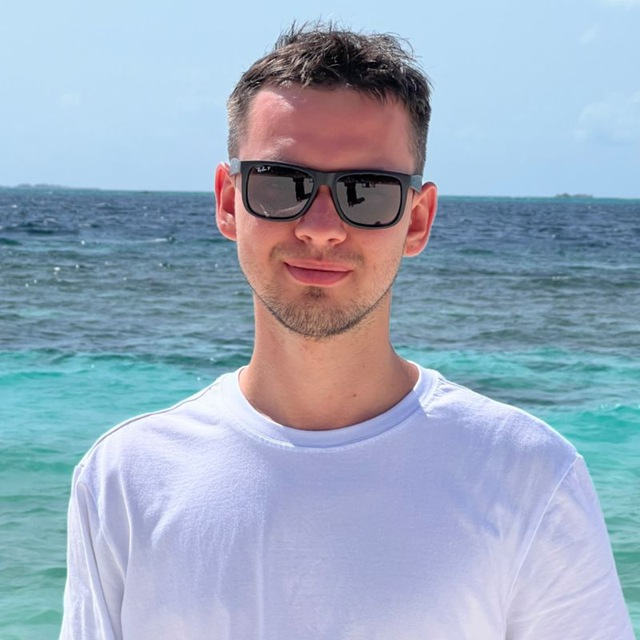

# Hi, I'm Denis 💁🏻‍♂️💻

<!--  -->

Golang and Python developer who secretly love frontend but most of the time work as a backend developer at [Lamoda](https://latech.ru/).

I have experience with microservices and event-driven architecture. Work in E-commerce on apps and website backend and 20+ microservices that provide discounts, catalog navigation, pricing, checkout, cart and other for our customers.

Like to work in a small to medium teams and help understand business requirements, plan and document architecture, decompose tasks, code and get things done. Always happy to help my colleagues.
