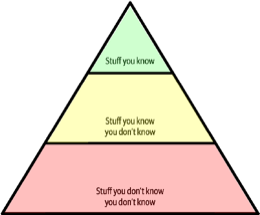

[Fundamentals of software architecture](https://www.amazon.com/Fundamentals-Software-Architecture-Comprehensive-Characteristics/dp/1492043451) is a book by Mark Richards and Neal Ford — hands-on practitioners who have taught software architecture classes professionally for years—focus on architecture principles that apply across all technology stacks.

This book left me with good basis of what role software architect plays in a company and extended my knowledge of different architecture patterns. In the following series of articles I'll write about topics from this book that I liked most.

## Who is a software architect?

The industry as a whole has struggled to precisely define "software architect". His role car range from expert programmer up to defining the strategic technical direction for the company. However, there are eight core expectations placed on a software architect irrespective of any given role, title, or job description:

* Make architecture decisions[^1]
* Continually analyze the architecture[^2]
* Keep current with latest trends[^3]
* Ensure compliance with decisions[^4]
* Diverse exposure and experience[^5]
* Have business domain knowledge[^6]
* Posses interpersonal skills[^7]
* Understand and navigate politics[^8]

## Unknown unknowns

Building software is hard and part of this difficulties lies antiquated accounting practices that cannot accommodate the exploratory nature of software development, but another part is because we’re traditionally bad at estimation, at least in part because of unknown unknowns.
\>…because as we know, there are known knowns; there are things we know we know. We also know there are known unknowns; that is to say we know there are some things we do not know. But there are also unknown unknowns—the ones we don’t know we don’t know.
-- Former United States Secretary of Defense Donald Rumsfeld

 > 
 > All architectures become iterative because of unknown unknowns, Agile just recognizes this and does it sooner.
 > -- Fundamentals of software architecture

## Architectural Thinking

 > 
 > An architect sees things differently from a developer’s point of view, much in the same way a meteorologist might see clouds differently from an artist’s point of view. This is called architectural thinking. Unfortunately, too many architects believe that architectural thinking is simply just “thinking about the architecture.
 > -- Fundamentals of software architecture

It's more than that. An architect should:

1. Understand the difference between architecture design and know how to collaborate with dev team to make it work;
1. Have a wide breadth of technical knowledge while still maintaining a certain level of technical depth, allowing the architect to see solutions and possibilities that others do not see;
1. Understand, analyse and reconcile trade-offs between various solutions and technologies;
1. Understand the importance of business drivers and how they translate to architectural concerns.
   \>Programmers know the benefits of everything and the trade-offs of nothing. Architects need to understand both. Thinking architecturally is looking at the benefits of a given solution, but also analyzing the negatives, or trade-offs, associated with a solution.
   \>	-- Fundamentals of software architecture

## Coupling and Cohesion

These terms are sometimes used interchangeably, but in fact they are not. They describe how things are intertwined with each other in different scopes. While cohesion is about "local" scope of objects (modules) that are closely related to each other, coupling scope is much larger and covers how different modules are connected with each other.

💡 Strive for high cohesion[^9] and low coupling

Programming languages usually have abstractions to express coupling and cohesion. Where cohesive objects are combined into package, module, class, component and these packages are connected to each other through interface.
It can also be translated to microservices, where interface is commonly represented as HTTP API. Thus, by following the rule above, a microservice should be highly cohesive to its business logic domain and loosely coupled to other microservices by maintaining as little interface as possible.

[^1]: Define the architecture decisions and design principles used to guide technology decisions within the team, the department, or across the enterprise.
[^2]:Continually analyse the architecture and current technology environment and then recommend solutions for improvement.
[^3]:Keep current with the latest technology and industry trends.
[^4]:Ensure compliance with architecture decisions and design principles.
[^5]:Exposure to multiple and diverse technologies, frameworks, platforms, and environments.
[^6]:Have a certain level of business domain expertise.
[^7]:Possess exceptional interpersonal skills, including teamwork, facilitation, and leadership.
[^8]:Understand the political climate of the enterprise and be able to navigate the politics.
[^9]:Cohesion refers to what extent the parts of a module should be contained within the same module. In other words, it is a measure of how related the parts are to one another. Ideally, a cohesive module is one where all the parts should be packaged together, because breaking them into smaller pieces would require coupling the parts together via calls between modules to achieve useful results.
